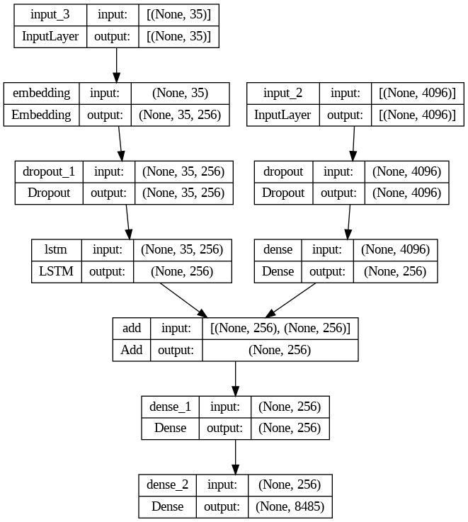

# <u>PictureTales-Smart Image Captioning</u>
This project generates descriptive captions for images using deep learning. The model takes an input image 
and returns a relevant caption.

## <u>Overview</u>
The system leverages a pretrained VGG16 model for feature extraction and a custom captioning model which was trained using LSTM for generating captions. The model is trained on the Flickr8k dataset  

The key components of the project include:
- Image feature extraction using a pretrained VGG16 model
- Caption preprocessing and tokenization
- Custom captioning model architecture
- Model training and evaluation
   
## Model Anatomy

## Outcome

